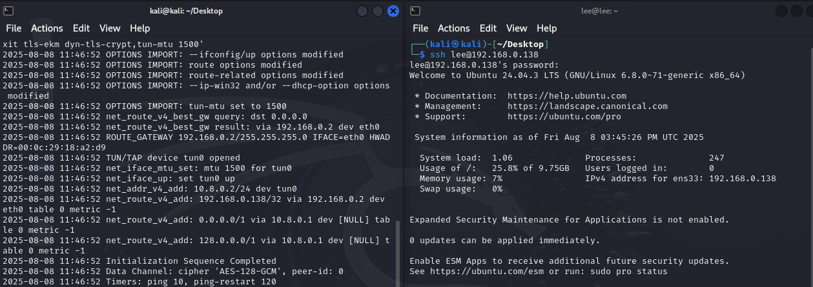

### **04_results.md**
markdown
# 4. 테스트 결과 (Results)

## 요약
- **차단 상태:** VPN 접속 실패 (TLS Error 발생)
- **허용 상태:** VPN 접속 성공 (정상 연결)

| 상태   | 결과            | 로그 예시                                  |
|--------|----------------|---------------------------------------------|
| 차단   | 실패           | TLS Error: TLS key negotiation failed...   |
| 허용   | 성공           | Initialization Sequence Completed          |

---

## 결론
- UFW를 통해 포트를 간단히 차단/허용하여 VPN 접속 가능 여부를 테스트할 수 있음.
- 해당 방식은 VPN 트래픽 제어, 보안 테스트, 문제 재현에 유용함.

---
